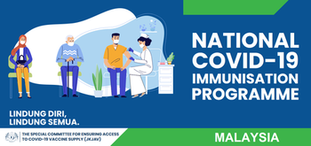
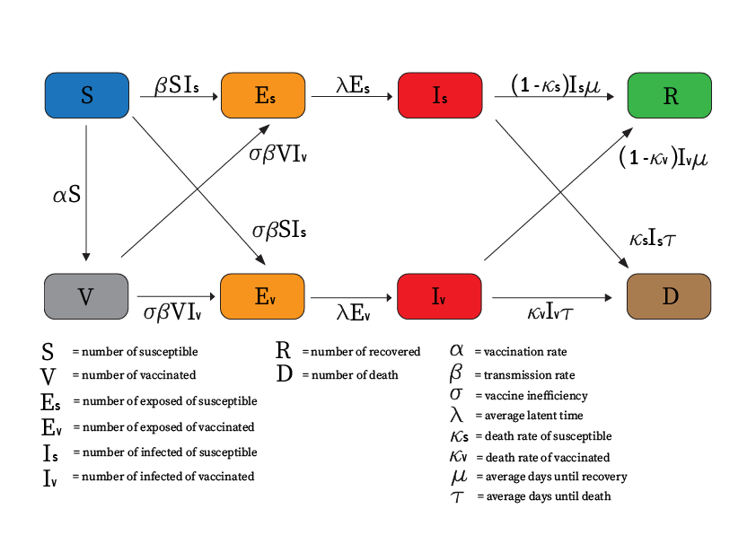
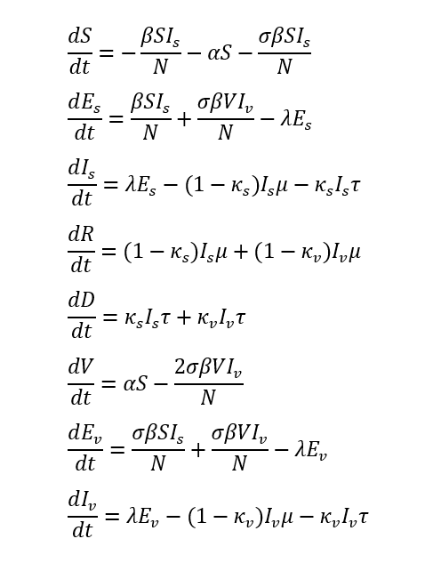

We're almost there, guys! Just a little more, and the project will be finished.

  

# Abstract
This paper presents a new compartmental model for studying and simulating the novel coronavirus (COVID-19) spread in Malaysia by incorporating the effect of the COVID-19 vaccine waning. 
Through this study, COVID-19 transmission is investigated by using the daily confirmed cases in Malaysia until August 31, 2021, as the index cases. 
The real COVID-19 data released by the Ministry of Health Malaysia (MOH) are being used to find some of the epidemiological parameters of this system. 
The proposed model is based on a susceptible, exposed, infected, and recovered (SEIR) compartmental model. However, to illustrate the objective situation, some additional compartments have been added. 
Furthermore, a mathematical analysis is carried out to find the epidemic equilibrium and the basic reproduction number, R_0 of the proposed model. 
The impact of various embedded parameters such as the transmission rate, vaccination program, outcome of the percentage of the vaccinated population, and the type of the vaccines wanes over time was explained in the numerical results.
Then, the Nelder-Mead algorithm is used as a method in optimization with real data conducted and the prediction on transmission trajectory of COVID-19 with the effect of vaccine waning was produced. 
By comparing all the data obtained, we can conclude that although getting vaccinated against COVID-19 can continue to reduce the risk of infections and death, a COVID booster is recommended for COVID-19 vaccines that have a fast-waning rate. 
Through this paper, herd immunity is expected to be achieved when 80% to 90% of people are needed to be vaccinated.

# Introduction
The highly contagious infectious disease caused by severe acute respiratory syndrome coronavirus 2 (SARS-CoV-2) or be referred to as the novel coronavirus disease 2019 (COVID-19) was first discovered in Wuhan City, China. Due to the alarming rate of transmission of COVID-19 across the region, the World Health Organization (WHO) have to declare COVID-19 a pandemic on 11 March 2020. By that time more than 118 000 cases had been reported in 114 countries with 4291 deaths [1].
 
Since there is no safe and effective medicine against COVID-19 yet, many countries have to impose various public health interventions to flatten the epidemic curve. These measures included public lockdown, quarantine, physical distancing, school’s closure, face masks mandatory in several places and prohibition of gathering to reduce the contact rate between individuals. The same goes for Malaysia when the second wave broke out on February 27, 2020, with worrying situations where a Movement Control Order (MCO) has been taken as one of the initiatives to break the chain of covid-19 on March 2020 [2,3]. 

Fortunately, at the beginning of 2021 saw various vaccines were given emergency approval and began to be distributed in countries all over the world [4]. As vaccines become available, the risk of COVID-19 related mortality and hospital admission show a decreasing pattern. However, many studies reported that the COVID-19 may continue to circulate even after achieving herd immunity through vaccination [5]. There is also research regarding the immunity against COVID-19 received from the COVID vaccine is not complete and wanes over time [6]. 

# Problem statements

COVID-19 is a communicable disease that struck Malaysia since February 2020 [7]. Since then, it has evolved into an unprecedented scale and caused health, socioeconomic and humanitarian crisis [8]. Even though, vaccine become available at the beginning of 2021, there are some studies that shows the effectiveness of the vaccines is gradually decreases over time [4,9,10]. This can be risky since vaccine has been viewed as a solution to provide long term immunity. From that, the spread of COVID-19 can be more unpredictable and deadly. 
On the other hand, there are also some parts of the society that still doubt about the vaccination. This is due to some numerous facts about the side effects of the vaccines [11]. Some may be concerned that vaccines are in a hurry due to the rapid progress of research, accompanied by vaccine hesitancy [12]. However, a result only can be achieved if people are willing to receive the vaccine.
Despite the hesitation, vaccines have been proven as the best way to achieve herd immunity in such a short period of time [13]. Herd immunity is needed to suppress the spread of COVID-19, only if majority of people become immunes to the disease. From there, the transmission of COVID-19 disease can be controlled.

# Objectives

a)	To propose a mathematical model forecasting transmission of COVID-19 in Malaysia by incorporating the effect of COVID-19 vaccine waning.   
b)	To study the impact of vaccination programs on COVID-19 outbreaks.   
c)	To investigate the percentage of people who need to be immune against COVID-19 disease in order to achieve herd immunity.

# Methodology

Through this situation, the use of mathematical modelling can play an important role in assisting to quantify possible disease control strategies to control the pandemic's spread and reduce the impact as well as forecast how the disease will be evolved [14]. The epidemiological model such as the SEIR model has been widely applied to model the transmission of COVID-19 [15,16,17]. In its classical form, it models the dynamic interaction of people that consists of four different compartments, the susceptible (S), exposed (E), infected (I), and recovered (R) [15]. 
Compare to the other models such as the SIR model that does not consist of exposed (E) compartment, the SEIR model is an established and appropriate approach to model the transmission of COVID-19 wherein the process of disease spread, the susceptible individual will move to the exposed population due to the incubation period [18]. Hence, with the modified SEIR model and several assumptions, the transmission of COVID-19 can be illustrated.

# Model framework and equation
By implementing the SEIR model with a few new compartments that are suitable for our study, the mathematical model of the spread and transmission of SARS-CoV-2 was formulated. We consider that there is a possibility for a person who has been vaccinated to get infected and thus spread the virus depending on the vaccine's effectiveness. Therefore, our model consists of eight compartments and every individual in a total human population (N) is in one of eight states - they are either susceptible (S) to the disease, exposed (Es) and infected (Is) people from the susceptible group to the disease, the person who is recovered (R) or died (D) from the disease, vaccinated (V) people, lastly, the exposed (Ev) and infected (Iv) people from the vaccinated group. In this context, we assume an exposed individual is infected, but not yet infectious, while the infected individual is infectious to other people. Thus, the disease transmission flow of this project is being illustrated in Figure 2:

  
   
  <em>Figure 2: The flow chart of the disease transmission</em>

 
| Parameter | Initial Value | Description | Referance |
|----------|----------|----------|----------|
|N | 32657400 | Total population size | [23] |
| &#945; | 0.00278 | Vaccination rate | [23] |
| &#946; | 0.25 | Transmission rate | Assumed |
| &#963; | 0.11 | Vaccine inefficacy (Pfizer) | [9] |
| λ-1 | 7 days | Average latent time | [24] |
| κs | 0.013 | Death rate of susceptible | [23]  |
| κv | 0.007 | Death rate of vaccinated | [23]  |
| μ-1 | 10 days | Average days until recovery | [25] |
| τ-1 | 28 days | Average days until death | [26] |

 

<em>Table 1: Initial model parameters and interpretations</em>

Noted that, the σ is the vaccine inefficacy where 0≤σ≤1. Thus 1-σ represents the vaccine efficacy and if σ=0, the vaccine will offer 100% protection against the infection of the disease. Then, the dynamics of the transitions between eight different compartments in Figure 2 can be expressed in the form of nonlinear ordinary differential equations. The ODE system is given by

With non-negative initial condition S(0)=Ss, Es(0)=Es0, Is(0)=Is0, R(0)=R0, D(0)=D0, V(0)=V0, Ev(0)=Ev0, and Iv(0)=Iv0. 

# The Model Assumptions
Following the proposed model, the exposed compartment plays an important role in
contributing to the potential exponential transmission of COVID-19. In doing so, we made six important assumptions:

1)	The total size of population remains constant where N = S +Es +Is +R +D +V +Ev +Iv.
2)	The population are mixed homogeneously.
3)	A constant population was assumed due to the short time period for the model development and projection, wherein changes of birth and death rates would be negligible.
4)	The death rate is constant in time.
5)	The probability of being infected does not depend on factors such as age, gender or social status.
6)	The asymptomatic and symptomatic infection is ignored.
7)	The risk of virus mutation or the emergence of variants that partly evade vaccines is negligible.

The epidemic equilibrium X^0 of the system (1) is obtained by setting all the derivatives to zero with I=0, 
X0=(N-K,0,0,0,0,K,0,0) , where S=N-K and V=K

## 2.3.2 The Basic Reproduction Number of the Model
Ro formulaa.......................................................................................

# 3. Result and discussion
## 3.1 Numerical method (Ode15s)
Since our model is a nonlinear equation, it might be impossible to use analytical method to solve it. However, in the numerical simulations section, we decided to use ode15s in MATLAB as numerical method for this project where ode15s is variable order solver based on the numerical differentiation formulas (NDFs) of order 1 to 5 and only works with functions that use two input argument, t and y [20]. Besides, ode15s is a multistep solver and it is used to solve a stiff problem [21].

## 3.2 The impact of vaccination program
On February 24, 2021, Malaysia began its Covid-19 vaccination program two days ahead of schedule, with Prime Minister Muhyiddin Yassin receiving the first dose of Pfizer-BioNTech. Besides, the first phase of the vaccination distribution will go until April. According to the government, it affects roughly 500,000 frontline workers, including health-care, defence and security employees, as well as teachers with co-morbidities [22]. As of August 31, 2021, a total of 15295254 people has received full vaccinations under National COVID-19 Immunization Program [23].

Here, we would like to study the impact of the vaccination program on COVID-19 outbreaks by assuming the initial value of infected from susceptible and vaccinated are roughly 2000 people. To see the noticeable difference in the number of deaths accumulated of COVID-19, we would like to divide the death group in the proposed model into two subgroups that contain the number of deaths from susceptible and the number of deaths from vaccinated with zero as the initial value for both of the subgroups. Hence, the simulation results for this section are shown in Figures 3.2(a) and 3.2(b) below.

  
  

  <em>Figure 3.2(a).The impact of vaccination program to the number of infected cases</em>

  
  

  <em>Figure 3.2(b).The impact of vaccination program to the number of deaths</em>

In Figure 3.2(a), we notice that the impact of vaccination program does show a significant decrease in the number of infected cases from vaccinated. On the day of the 100th, we observe a reduction of 87.39% for those who have been vaccinated compared to the susceptible people. The same goes to the number of the cumulative deaths in Figure 3.2(b), where there is a reduction of 91.55% on the day of the 300th for those who have been vaccinated. Therefore, from the results obtained, we can conclude that COVID-19 are effective at preventing infection, serious illness, and death. Vaccination can help protect those who are vaccinated as well as those around them by reducing the transmission of disease.

## 3.3 The impact of transmission rate
At the onset of the COVID-19 pandemic, Malaysia had initiated travel restrictions and quarantine. However, the situation got worse when there is an increasing number of COVID-19 cases that forced the government of Malaysia to initiate the Movement Control Order (MCO) on 18 March 2020 [27]. Under the Prevention and Control of Infectious Diseases Act 1988 and well as the Police Act 1967, the Movement Control Order is imposed to measures that encompassed restrictions on movement, assembly and international travel, and mandated the closure of business, industry, government and educational institutions to curb the spread of SARS-CoV-2, that causes COVID-19 [28]. On the other hand, the use of face masks also would be mandatory at crowded places in hope that all these efforts will help to reduce the rate of transmission of the COVID-19 [29].
In this section, we would like to study the impact of transmission rate on the COVID-19 outbreaks by simulating the three different scenarios where the rates of transmission are 0.5, 0.4 and 0.3. The rate of transmission, 0.3 is the lowest in this section where we assume various public health interventions are being imposed and the community has an awareness to follow almost all the preventive measures taken by the government against the COVID-19 outbreak compared to the 0.5, rate of transmission. The simulation results can be seen in Figures 3.3(a) and 3.3(b) respectively.

  
  

  <em>Figure 3.3(a). The impact of transmission rate to the number of infected cases</em>

  
  

  <em>Figure 3.3(b). The impact of transmission rate to the number of deaths</em>

The quantitative analysis in Figure 3.3(a) can be explained by comparing the highest number of infected cases for  = 0.5 with  = 0.4 and 0.3. We observed there is a reduction of 35.87% in the number of infected cases for  = 0.4 while  = 0.3 shows a reduction up to 72.91%. Meanwhile, on the last day of the simulations (300th days) in Figure 3.3(b), there is a reduction of 13.81% and 39.54% in the number of cumulative deaths for  = 0.4 and 0.5 respectively. In addition, the number of cumulative deaths in Figure 3.3(b) shows a constant trend or have the same output for a certain time frame due to the decreased number of infected cases in figure 3.3(a). 
Therefore, we can conclude that the lower the rate of transmission, the lower the risk to get infected by COVID-19 and thus reducing the number of cumulative deaths. Practising preventive measures such as physical or social distancing, quarantining, covering coughs and sneezes, hand washing, and keeping unwashed hands away from the face can minimize the risk of transmissions. Wearing a face mask is recommended as part of personal protective equipment and as a public health measure to prevent the spread of coronavirus disease 2019 (COVID-19) pandemic.

## 3.4 The outcome of vaccinated population achieved for COVID-19 disease 

In the fight against the global spread of COVID-19, vaccination would be the best approach to acquire herd immunity against the virus. However, in reality, the world's medical experts still have much to learn about this novel virus. Herd immunity in this context means where a large portion of a community becomes immune to the disease and the disease is less likely to spread from one person to another. As a result, it will protect the entire community, not just those with immunity [13]. 
Many countries are pinning their hopes on the COVID-19 vaccine as the solution for normalcy. At this point, Malaysia is currently progressing quite well in terms of the inoculation of its population where more than 500,000 vaccinations have been recorded as daily COVID-19 vaccination on July 29 [30]. As of September 1, 2021, the percentage of the population that has received two doses of vaccines in Malaysia has achieved a 47% vaccinated population through the National Immunization Program (NIP) [23]. However, we have not seen a substantial reduction in the daily number of COVID-19 cases [23].
Thus, we would like to investigate the outcome of the vaccinated population for COVID-19 in Malaysia by simulating three different cases where we have achieved a 40%, 60% and 80% total vaccinated population. The trend of the COVID-19 transmission can be investigated from the results we obtained below. 

  
  

  <em>Figure 3.4(a). The outcome of differ percentage of vaccinated people to the number of infected cases</em>

  
  

  <em>Figure 3.4(b). The outcome of differ percentage of vaccinated people to the number of deaths</em>

From the simulation results obtained in Figure 3.4(a), on the day of the 100th, we observed that when the vaccinated people have reached 60% of the population, there is a reduction of 85.61% in the number of infected cases and when the number of vaccinated have reached 80% of the population, there is a 99.14% reduction from the 40% vaccinated population. The same goes in Figure 3.4(b), where we noticed a decline in the number of deaths due to an increase in the percentage of vaccinated people. On the last day of the simulations (300th day), the 60% vaccinated people have reduced to 48.25% number of deaths which is lower compared to 58.83% for the 80% vaccinated people. 
The more contagious the disease is, the greater the proportion of the population that needs to be immune against the disease. Therefore, we can conclude that the total percentage of vaccinated people are needed to achieve herd immunity is estimated at around 80% to 90%. However, this only can be achieved if the viruses are not mutated or the emergence of variants that partly evade vaccine-induced antibodies.

## 3.5 The type of vaccines wanes

By January 20, 2022, there are currently seven vaccines approved for use in Malaysia [31]. In this paper, we would like to focus on three types of vaccines that are mostly used in Malaysia for vaccination drive which are Pfizer-BioNTech, AstraZeneca and Sinovac. These three vaccines have been assessed by the Ministry of Health (MoH) to have met safety and efficacy standards [32,33,34].
However, there is a study about these vaccines’ wanes after a certain period and the efficiency of the vaccines are illustrated in Figure 3.5.

  
    

    <em>Figure 3.5. The three types of vaccines wanes over time [9,10]</em>

### 3.5.1 The function of vaccines wanes 
Here, we are able to obtain three functions from Figure 8 to show the progress of vaccine waning for these respective vaccines over time. We observe that all three types of vaccines are in a declining pattern. Thus, one of the ways to describe the trend is by using an exponential function.
The exponential function has the form:
Ft=y=abt , where a≠0 and b is a constant when 0<b<1, the function represents exponential decay.

BioNTech, Pfizer vaccine:
F0=y=ab0=0.89 -(2)
F150=y=ab150=0.68 -(3)
From eq. 2 we already have a=0.89, and by comparing these two equations we can obtained
ab150ab0=0.680.89
b150=0.76404
b=1500.76404
b=0.9982
Therefore, we have the function of y=0.89∙0.9982t to describe the Pfizer covid-19 vaccines wanes within 5 months.
By doing the same method for AstraZeneca and Sinovac vaccines, we have the function y=0.77∙0.9991t for AstraZeneca and y=0.76∙0.9934t for Sinovac vaccines respectively.
Thus, the decline in protection against infection for each three types of vaccines can be expressed in Figure 3.5.1 by using the exponential functions obtained.

  
  

  <em>Figure 3.5.1. The trend of the three types of vaccines wanes over time</em>

### 3.5.2 The effect of vaccine wanes over time

The decline in the effectiveness of vaccines against the disease will affect our efforts to curb the epidemic where the number of infections and deaths is expected to increase. Thus, in this section, we would like to study the effect of vaccine waning on the proposed model and by using the functions obtained from respective vaccines, the impact of the vaccine wanes can be seen on the number of infected cases and deaths. Assuming the other parameters are the same as in table 1 above except for the vaccine efficiency, the simulation results are shown in Figures 3.5.2(a) and 3.5.2(b).

  
  

  <em>Figure 3.5.2(a). The effect of COVID vaccines wanes to the infected cases</em>

  
  

  <em>Figure 3.5.2(b). The effect of COVID vaccines wanes to the number of deaths</em>

From Figure 3.5.2(a), we observed that Sinovac shows the highest number of infected cases achieved compared to the other vaccines. About 176% increase in the number of highest infected cases calculated from the Pfizer-BioNTech while AstraZeneca only shows about 28% increases. Furthermore, on the last day of the simulations (300th day) in Figure 3.5.2(b), Sinovac has increased up to 133% in the number of cumulative deaths while AstraZeneca has slightly increased to 8% from the number of cumulative deaths of Pfizer.
In conclusion, a COVID booster shot might be needed for Sinovac recipients to provide an extra layer of protection due to the faster waning period. These results also have helped to shape the current booster recommendations in Malaysia [35].

# 4. The optimization of the proposed model
Optimizing functions is one of the most common problems of mathematics and is also very often required in real-world problems. The use of an optimization algorithm is often required in solving the optimization problem where it is a procedure that is executed iteratively by comparing various solutions till an optimum or a satisfactory solution is found [36].
The use of an optimization algorithm is required where there are some parameters in our proposed model which may be varied with the real-life situation such as the rate of contacts between people in the population or in this context, we refer to it as the rate of transmission (). Thus, optimization of the proposed model for the transmission of COVID-19 is been done to find the uncertain parameters in the proposed model which are the rate of transmission (), the death rate of susceptible (S), and the death rate of vaccinated people (V). By assuming that these parameters have different values for every 12 days, the objective results in this section can be obtained below.
4.1 The Nelder-mead simplex method
The Nelder-Mead algorithm or known as Simplex Search Algorithm is first published in 1965. It is one of the best-known algorithms for multidimensional, unconstrained optimization without derivatives and is very popular in many fields of science and technology, especially in chemistry and medicine. The method is suitable for problems with non-smooth functions where it does not require any derivative information. It is widely used to solve parameter estimation and similar statistical problems and also used for problems with discontinuous functions, which occur frequently in statistics and experimental mathematics [37].
Hence, the Nelder-Mead simplex method is used in this paper to determine the next estimated parameter values for each iteration by using several techniques contract, reflect, expand, and etc. The residue sum of square (RSS) is been used as the objective function:

\( e = \frac{1}{N} \sum_{i=0}^{N} (I_{\text{observed}} - I_{\text{target}})^2 \)-------------------RSS method

The error remaining between the regression function and the data set will be measures by the RSS. It also acts as the termination condition where when the objective function has converged to nearly zero or unchanged. Also, the smaller the residual sum of square, the better our model fits the targeted data [38].

## 4.2 Optimization results
Through this section, we would like to focus more on BioNTech, Pfizer vaccine since it is the most vaccine used in Malaysia [39]. By using the Nelder-Mead simplex algorithm with the residue sum of square, the optimization can be achieved. The optimization results are display in Figures 4.2(a), 4.2(b) and 4.2(c) respectively.

  
  

  <em>Figure 4.2(a). The optimization of the active cases</em>

  
  

  <em>Figure 4.2(b). The optimization of the number of cumulative susceptible deaths</em>

  
  

  <em>Figure 4.2(c). The optimization of the number of cumulative vaccinated deaths</em>

We observed that in the early phase of time, there is a small S-curve on the graph in Figure 4.2(a). This is due to the average latent of time of our model for the infected individual to become infectious. However, we able to see that our model are almost fits with the actual data. The value of the uncertain parameters in the proposed model which are the rate of transmission (), the death rate of susceptible (S), and the death rate of vaccinated people (V) that are different for every 12 days are able to be defined and will be used in the section 4.3.

## 4.3 Prediction on transmission trajectory of COVID-19 with the effect of vaccine waning

Here, by using the data obtained in section 4.2, the prediction on transmission trajectory of COVID-19 with the effect of vaccine waning can be illustrate in the Figures below. 

  
  

  <em>Figure 4.3(a). The prediction on the number of active cases with vaccine waning effect</em>

  
  

  <em>Figure 4.3(b). The prediction on the number of cumulative susceptible deaths with vaccine waning effect</em>

  
  

  <em>Figure 4.3(c). The prediction on the number of cumulative vaccinated deaths with vaccine waning effect</em>

From Figure 4.3(a), we observe a slight increase in the number of active cases due to the decline in protection against the infection and almost no noticeable change in the number of cumulative susceptible deaths in Figure 4.3(b). However, there was a significant increase in the number of cumulative vaccinated deaths when the vaccine waning effect is included in Figure 4.3(c) and an increase of 27.89% can be calculated on the last day of the simulation (96 days).
Although there shows an increase in the number of infected cases and deaths due to the vaccine wanes, it is still in a controlled state. To reinforce this, the implemented social distancing and various counter measures plays important roles in controlling the spread of COVID-19.

# 5. Conclusion 

From all the data obtained, we can conclude that getting vaccinated against COVID-19 can continue to reduce the risk of infections and deaths. Despite the vaccine effectiveness decreasing over time, the problem is still solvable by registering COVID booster shots for fast-waning vaccines. Besides the vaccination, there are other ways that can help to reduce the spread of the disease which is by implementing various countermeasures such as social distancing, wearing a mask in public and quarantining.
On the other hand, vaccination also has been proven as one of the primary methods to achieve herd immunity in such a short period of time compare to natural immunity. Therefore, herd immunity can be achieved if at least 80% to 90% of the total population are vaccinated and only the risk of virus mutation or the emergence of variants that partly evade vaccine is negligible.

## References

1. World Health Organization. (n.d.). About the virus. WHO/Europe. Retrieved October 5, 2021, from https://www.euro.who.int/en/health-topics/health-emergencies/coronavirus-covid-19/novel-coronavirus-2019-ncov
2. Hashim, J. H. (2021, May 7). COVID-19 Epidemic in Malaysia: Epidemic Progression, Challenges, and Response. Frontiers. Retrieved October 7, 2021, from https://www.frontiersin.org/articles/10.3389/fpubh.2021.560592/full
3. Sukumaran, T. (2020, March 18). Coronavirus: Malaysia in partial lockdown from March 18 to limit outbreak. South China Morning Post. Retrieved October 28, 2021, from https://www.scmp.com/week-asia/health-environment/article/3075456/coronavirus-malaysias-prime-minister-muhyiddin-yassin
4. Staff, A. (2021, August 3). A Timeline of COVID-19 Vaccine Developments in 2021. AJMC. Retrieved November 2, 2021, from https://www.ajmc.com/view/a-timeline-of-covid-19-vaccine-developments-in-2021
5. Nature Editorial. (n.d.). Five reasons why COVID herd immunity is probably impossible. Nature. Retrieved November 4, 2021, from https://www.nature.com/articles/d41586-021-00728-2?error=cookies_not_supported&code=2d90b2e6-d2d1-436b-bc97-487eb20aa739
6. Coronavirus Disease 2019 (COVID-19). (2020, February 11). Centers for Disease Control and Prevention. Retrieved November 8, 2021, from https://www.cdc.gov/coronavirus/2019-ncov/science/science-briefs/vaccine-induced-immunity.html
7. Elengoe, A. (2020, May 11). COVID-19 Outbreak in Malaysia. Ophrp.Org. Retrieved November 20, 2021, from https://ophrp.org/journal/view.php?number=559#:%7E:text=The%20first%20Malaysian%20was%20confirmed,Hospital%2C%20Selangor%20%5B24%5D.
8. The socioeconomic impacts of COVID-19 in Malaysia: Policy review and guidance for protecting the most vulnerable and supporting enterprises. (2020, July 21). Ilo.Org. Retrieved December 2, 2021, from https://www.ilo.org/asia/publications/WCMS_751600/lang--en/index.htm
9. C. (2021, November 25). After Three Months, Sinovac Vaccine Only 28% Effective Against ICU Admission. CodeBlue. Retrieved November 26, 2021, from https://codeblue.galencentre.org/2021/11/24/after-three-months-sinovac-vaccine-only-28-effective-against-icu-admission/
10. Iacobucci, G. (2021, August 25). Covid-19: Protection from two doses of vaccine wanes within six months, data suggest. The BMJ. Retrieved November 11, 2021, from https://www.bmj.com/content/374/bmj.n2113
11. COVID Vaccine Side Effects. (n.d.). Johns Hopkins Medicine. Retrieved December 1, 2021, from https://www.hopkinsmedicine.org/health/conditions-and-diseases/coronavirus/covid-vaccine-side-effects
12. Solis-Moreira, J. (2021, November 13). How did we develop a COVID-19 vaccine so quickly? Medicalnewstoday. Retrieved December 20, 2021, from https://www.medicalnewstoday.com/articles/how-did-we-develop-a-covid-19-vaccine-so-quickly
13. Herd immunity and COVID-19 (coronavirus): What you need to know. (2021, December 17). Mayo Clinic. Retrieved January 6, 2022, from https://www.mayoclinic.org/diseases-conditions/coronavirus/in-depth/herd-immunity-and-coronavirus/art-20486808#:%7E:text=quickly%20become%20overwhelmed.-,Vaccines,causing%20illness%20or%20resulting%20complications.
14. Mathematical Modelling at a Glance: A Theoretical Study. (2012, January 1). ScienceDirect. Retrieved January 3, 2022, from https://www.sciencedirect.com/science/article/pii/S1877042812018228#:%7E:text=Mathematical%20modeling%20is%20one%20of,a%20real%20or%20believable%20situation.
15. Carcione, J. M. (2020, May 28). A Simulation of a COVID-19 Epidemic Based on a Deterministic SEIR Model. Frontiers. Retrieved January 3, 2022, from https://www.frontiersin.org/articles/10.3389/fpubh.2020.00230/full
16. Mwalili, S., Kimathi, M., Ojiambo, V., Gathungu, D., & Mbogo, R. (2020). SEIR model for COVID-19 dynamics incorporating the environment and social distancing. BMC research notes, 13(1), 352. https://doi.org/10.1186/s13104-020-05192-1
17. Chung, N.N., Chew, L.Y. Modelling Singapore COVID-19 pandemic with a SEIR multiplex network model. Sci Rep 11, 10122 (2021). https://doi.org/10.1038/s41598-021-89515-7
18. Collins, S. (2020, March 19). Coronavirus Incubation Period. WebMD. Retrieved December 30, 2021, from https://www.webmd.com/lung/coronavirus-incubation-period#1
19. Fosu, G. O., Akweittey, E., & Adu-Sackey, A. (2020). Next-generation matrices and basic reproductive numbers for all phases of the Coronavirus disease. Open Journal of Mathematical Sciences, 4(1), 261–272. https://doi.org/10.30538/oms2020.0117
20. Solve stiff differential equations and DAEs — variable order method - MATLAB ode15s. (n.d.). Mathworks. Retrieved October 27, 2021, from https://www.mathworks.com/help/matlab/ref/ode15s.html#:%7E:text=ode15s%20is%20a%20variable%2Dstep,ode15s%20is%20a%20multistep%20solver.
21. ode45, ode23, ode113, ode15s, ode23s, ode23t, ode23tb (MATLAB Functions). (n.d.). Ece.Nothwestern. Retrieved December 27, 2021, from http://www.ece.northwestern.edu/local-apps/matlabhelp/techdoc/ref/ode45.html
22. Bloomberg - Malaysia Starts Coronavirus Vaccination, PM Gets First Shot. (2021, February 24). Bloomberg. Retrieved October 18, 2021, from https://www.bloomberg.com/tosv2.html?vid=&uuid=9ca42d03-8850-11ec-914a-624248557050&url=L25ld3MvYXJ0aWNsZXMvMjAyMS0wMi0yNC9tYWxheXNpYS1zdGFydHMtY29yb25hdmlydXMtdmFjY2luYXRpb24tcG0tZ2V0cy1maXJzdC1zaG90
23. M. (n.d.). GitHub - MoH-Malaysia/covid19-public: Official data on the COVID-19 epidemic in Malaysia. Powered by CPRC, CPRC Hospital System, MKAK, and MySejahtera. GitHub. Retrieved September 20, 2021, from https://github.com/MoH-Malaysia/covid19-public#readme
24. Hualei Xin, Yu Li, Peng Wu, Zhili Li, Eric H Y Lau, Ying Qin, Liping Wang, Benjamin J Cowling, Tim K Tsang, Zhongjie Li, Estimating the Latent Period of Coronavirus Disease 2019 (COVID-19), Clinical Infectious Diseases, 2021;, ciab746, https://doi.org/10.1093/cid/ciab746
25. Gallagher, B. J. (2020, May 1). Coronavirus: How long does it take to recover? BBC News. Retrieved October 10, 2021, from https://www.bbc.com/news/health-52301633
26. Leoni, M. L. G., Lombardelli, L., Colombi, D., Bignami, E. G., Pergolotti, B., Repetti, F., Villani, M., Bellini, V., Rossi, T., Halasz, G., Caprioli, S., Micheli, F., & Nolli, M. (2021). Prediction of 28-day mortality in critically ill patients with COVID-19: Development and internal validation of a clinical prediction model. PLOS ONE, 16(7), e0254550. https://doi.org/10.1371/journal.pone.0254550
27. Times, N. S. (2020, March 16). 14-day Movement Control Order begins nationwide on Wednesday. NST Online. https://www.nst.com.my/news/nation/2020/03/575180/14-day-movement-control-order-begins-nationwide-wednesday
28. What is allowed under the MCO, CMCO and RMCO? (2021, January 11). The Edge Markets. Retrieved December 12, 2021, from https://www.theedgemarkets.com/article/what-allowed-under-mco-cmco-and-rmco
29. Auto, H. (2020, August 1). Malaysia implements mandatory mask-wearing in crowded places from Aug 1. The Straits Times. https://www.straitstimes.com/asia/se-asia/malaysia-implements-mandatory-mask-wearing-in-crowded-places-from-aug-1
30. B. (2021a, August 1). Covid-19 cases in greater Klang Valley may decline mid August. NST Online. https://www.nst.com.my/news/nation/2021/08/713743/covid-19-cases-greater-klang-valley-may-decline-mid-august
31. Malaysia – COVID19 Vaccine Tracker. (n.d.). Covid19.Trackvaccines. Retrieved January 2, 2022, from https://covid19.trackvaccines.org/country/malaysia/
32. Pfizer-BioNTech vaccine granted conditional registration for use in Malaysia — Khairy. (2021, January 8). The Edge Markets. Retrieved November 3, 2021, from https://www.theedgemarkets.com/article/pfizerbiontech-vaccine-given-conditional-registration-use-malaysia-%E2%80%94-khairy
33. Malaysia approves conditional registration of AstraZeneca vaccine. (2021, April 2). The Edge Markets. Retrieved November 3, 2021, from https://web.archive.org/web/20210522035505/https://www.theedgemarkets.com/article/astrazeneca-covid19-vaccine-gets-conditional-registration-approval-malaysian-authorities
34. Staff, R. (2021, March 2). Malaysia approves Sinovac, AstraZeneca COVID-19 vaccines for use. U.S. Retrieved November 4, 2021, from https://www.reuters.com/article/us-health-coronavirus-malaysia-idUSKBN2AU19V
35. Reuters. (2021, December 16). Malaysia imposes stricter rules, booster requirements over Omicron threat. Retrieved January 28, 2022, from https://www.reuters.com/world/asia-pacific/malaysia-imposes-stricter-rules-booster-requirements-over-omicron-threat-2021-12-16/
36. Brownlee, J. (2021, October 11). How to Choose an Optimization Algorithm. Machine Learning Mastery. Retrieved February 1, 2022, from https://machinelearningmastery.com/tour-of-optimization-algorithms/
37. Singer, S., & Nelder, J. (2009). Nelder-Mead algorithm. Scholarpedia, 4(7), 2928. https://doi.org/10.4249/scholarpedia.2928
38. How the Residual Sum of Squares (RSS) Works. (2022, January 9). Investopedia. Retrieved February 3, 2022, from https://www.investopedia.com/terms/r/residual-sum-of-squares.asp
39. Vaccinations in Malaysia. (n.d.). COVIDNOW. Retrieved January 4, 2022, from 
https://covidnow.moh.gov.my/vaccinations/

